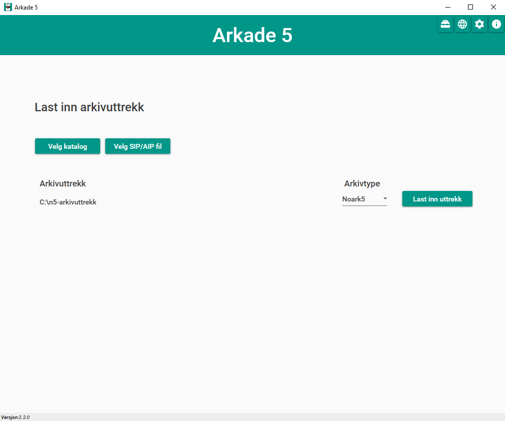
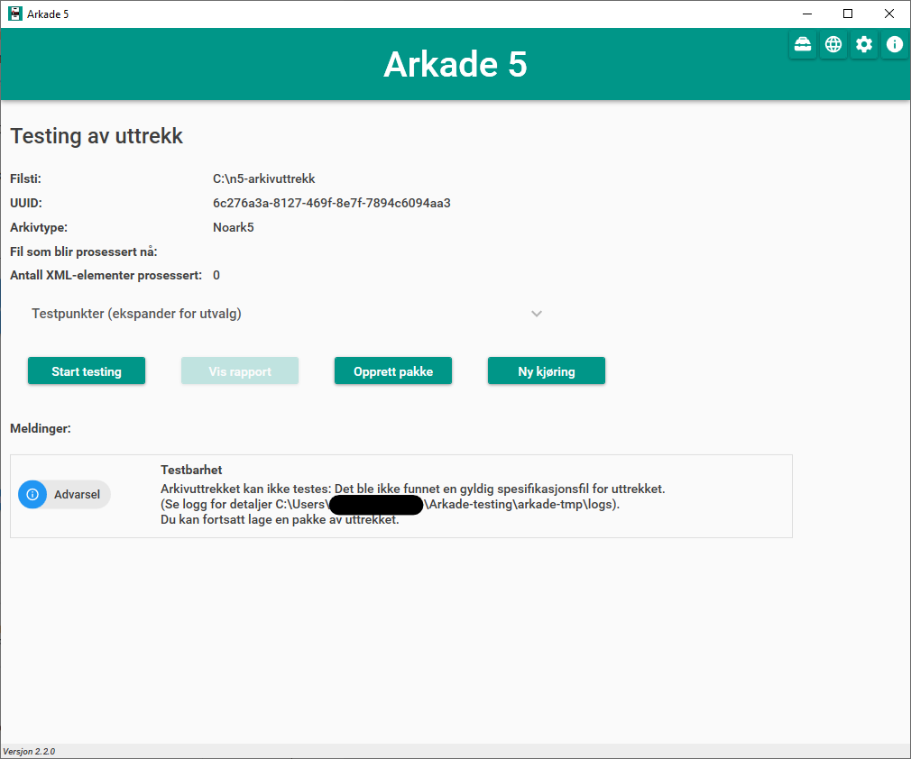
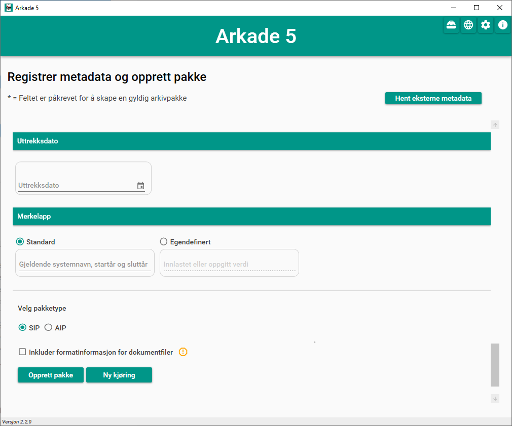
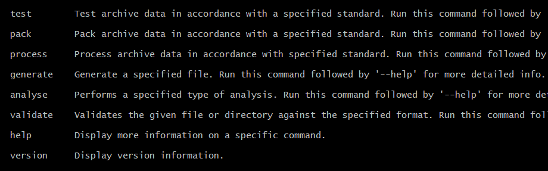

Brukerveiledning
================

Arkade 5
********

**Skrivebordsapplikasjon for Windows**

Arkade 5 brukes ved å lese inn et arkivuttrekk, utføre testing av uttrekket og/eller opprette en arkivpakke av uttrekket. Ved testing genereres det en utfyllende testrapport.
Arkade 5 muliggjør også opprettelse/endring av metadata for arkivuttrekk.

Oppstart/avslutning
~~~~~~~~~~~~~~~~~~~

Ved oppstart av Arkade åpnes innlastingsvinduet. Dersom et tilgjengelig område for midlertidige filer ikke allerede er definert, vil Arkade først be om at dette blir oppgitt (se innstillinger - tannhjul i hjørnet oppe til høyre). Arkade avsluttes ved å lukke hovedvinduet. Ved avslutning igangsettes sletting av midlertidige filer.

Menyvalg
~~~~~~~~

Øverst til høyre finnes det til enhver tid fire menyvalg:

.. |menuItem_tools| image:: img/MenuItem_Tools.png

| |menuItem_aboutArkade| **- Om Arkade**
| Åpner et nytt vindu med informasjon om Arkade 5.

| |menuItem_settings| **- Innstillinger**
| Åpner et nytt vindu med innstillinger brukeren kan tilpasse:
| 	- Arkade sitt prosesseringsområde.
| 	- Språk i brukergrensesnitt (`Se systemdokumentasjon for støttede språk`_)
| 	- Språk for utdata (`Se systemdokumentasjon for støttede språk`_)
| 	- Mørk/lys modus.

.. _Se systemdokumentasjon for støttede språk: Systemdokumentasjon.html#multilingual-support

| |menuItem_webPage| **- Hjemmeside**
| Åpner hjemmesiden til Arkade i standard nettleser.

| |menuItem_tools| **- Verktøy**
| Åpner et nytt vindu med tilleggsverktøy for Arkade:
| 	- PRONOM-filanalyse av en valgt katalog.
| 	- Validering av arkivformat for en valgt fil.
| 	- Generering av en mal-fil for `import av metadata <#arkivpakkevinduet>`_.

Innlastingsvinduet
~~~~~~~~~~~~~~~~~~

Innlasting
----------

Velg og last inn arkivuttrekket som skal behandles:

1) Klikk på knappen "Velg katalog" dersom uttrekket er en ordinær fil-/mappestruktur. I tilfelle velges katalogen som inneholder arkivbeskrivelse-filen (addml.xml eller arkivuttrekk.xml). Klikk på knappen "Velg fil" dersom uttrekket er en .siard-fil eller en AIP/SIP-struktur pakket som en tar-fil.

2) Dersom Arkade ikke automatisk har klart å detektere arkivtypen, oppgi arkivtype for det valgte uttrekket. Arkade 5 støtter typene "**Fagsystem**", "**Noark 3**", "**Noark 5**" og "**Siard**".

3) Klikk på knappen "Last inn uttrekk". Det valgte uttrekket vil lastes inn og åpnes i testvinduet.

Testvinduet
~~~~~~~~~~~

Øverst i testvinduet vises:

* Full filsti for det valgte uttrekket
* En unik identifikator (UUID), generert for den gjeldende behandlingen av det valgte uttrekket
* Valgt arkivtype
* Hvilken fil som under testing prosesseres i øyeblikket
* Løpende informasjon om testkjøring*
* Informasjon om testframdrift i prosent (N5/N3/Fagsystem) eller som statusmeldinger (Siard)

*\*For uttrekk av typen Noark 5 vises antall prosesserte XML-elementer. For uttrekk basert på en ADDML-fil vises antall prosesserte filer og antall prosesserte poster.*

Testkjøring
-----------

Klikk på knappen "Start testing" for å starte testkjøring på det valgte uttrekket. Testkjøringen vil vare fra noen minutter til mange timer, avhengig av uttrekkets størrelse.

Under testkjøring vil det, i den nedre delen av vinduet, vises meldinger om innlesing, ev. strukturelle feil/mangler ved uttrekket, rapportgenerering og fullført testing.

Testrapport
-----------

Etter fullført testing vil det genereres en rapport i formatene HTML, PDF/A-1b, XML og JSON. Klikk på knappen "Vis rapport" for å åpne HTML-versjonen i en nettleser eller eksportere en katalog med rapporten i alle formater.

*(!) Ved opprettelse av arkivpakke inkluderes alltid testrapporten i alle formater.*

Arkivpakkegenerering
--------------------

Klikk på knappen "Opprett pakke" for å lage en arkivpakke (AIP/SIP) av uttrekket. Dette åpner arkivpakkevinduet der valg for pakken kan gjøres før den opprettes.

*Det er mulig å opprette en arkivpakke uten først å utføre testing av det aktuelle arkivuttrekket. En slik pakke vil ikke inneholde noen testrapport.*

Nytt uttrekk / ny kjøring
-------------------------

Ved klikk på knappen "Ny kjøring" avsluttes pågående arkivbehandling og Arkade returnerer til innlastingsvinduet. 
Dersom det inneværende arkivuttrekket endres, f.eks. som følge av feil/mangler vist i testrapporten, må uttrekket lastes inn på nytt (og ev. tester kjøres på nytt) før knappen "Opprett pakke" oppretter en pakke som inneholder endringene (og knappen "Vis rapport" åpner en gyldig testrapport). Uttrekket lastes inn på nytt ved å klikke "Ny kjøring" (eller ved å starte Arkade på nytt).

*NB! Skal det opprettes en arkivpakke som inkluderer resultatene fra inneværende testkjøring, må dette gjøres før "Ny kjøring" klikkes (eller Arkade avsluttes).*

Arkivpakkevinduet
~~~~~~~~~~~~~~~~~

Før arkivpakke opprettes registreres aktuelle metadata. For å skape en gyldig arkivpakke må påkrevde felter (merket *) utfylles. Dersom det aktuelle arkivuttrekket i utgangspunktet var en arkivpakke (AIP/SIP) med allerede definerte metadata, vil Arkade forsøke å lese disse inn og forhåndsutfylle feltene i arkivpakkevinduet. Ved å klikke knappen "Hent eksterne metadata" kan det velges en fil med forhåndsdefinerte metadata, enten en METS-fil (f.eks. {uuid}.xml, info.xml eller dias-mets.xml fra tidligere produsert pakke) eller metadata på JSON-format (f.eks. generert med Arkade CLI) for automatisk utfylling av feltene. Når pakken opprettes skrives den utfylte informasjonen til filen dias-mets.xml som legges ved i arkivpakken. Metadataene skrives også til filen {uuid}.xml som legges utenfor, på samme nivå som, arkivpakken.

I nedre del av vinduet velges ønsket pakketype, SIP eller AIP.

Dersom "Inkluder formatinformasjon for dokumentfiler", eller "Inkluder formatinformasjon for LOBer" for Siard-uttrekk, velges vil Arkade lage en csv-fil med forespurt informasjon og lagre denne på følgende lokasjon i tar-filen: :file:`\{uuid\\\}\\administrative_metadata\ `. (*Pakkeuavhengig formatanalyse av innholdet i en hvilken som helst katalog er tilgjengelig fra "verktøy"-menyvalget:* |menuItem_tools|).

Når ønskede metadata er oppgitt, klikkes knappen "Opprett pakke". Dette åpner et dialogvindu for valg av pakkens plassering. Ved valgt plassering opprettes arkivpakken.

Arkivpakken vil opprettes som en tar-fil og filnavnet vil være UUID-en som er generert for den gjeldende arkivbehandlingen: :file:`\{uuid\\\}.tar`. Pakken og tilhørende :file:`\{uuid\\\}.xml`-fil plasseres i en katalog :file:`Arkaderesultater-\{uuid\\\}`. Når alt er ferdig generert, vises denne katalogen på den valgte plasseringen.

**NB! Knappen "Ny kjøring" avslutter gjeldene arkivbehandling.**

.. tip:: 

    **Pakke re-generering**
	*Så lenge arkivpakkevinduet ikke forlates, kan metadata endres og "Opprett pakke" klikkes på nytt. Velges samme pakkeplassering, overskrives foregående pakke og* :file:`\{uuid\\\}.xml` *med oppdaterte metadata. Sørg bare for at filene som skal overskrives ikke er opptatt, f.eks. ved at de er åpnet i andre programmer.*

	*--------------------------------*
	
    **ESSArch-tilpasninger**
	*Følgende operasjoner kan forenkle innlastning av arkivpakke i ESSArch:*
	
	* *Navn om pakkeinformasjonsfilen fra* :file:`\{uuid\\\}.xml` til :file:`info.xml` *(eller annet fast navn iht. ESSArchs  konfigurasjon)*
	* *Fjern linjene i pakkeinformasjonsfilen som beskriver filen dias-mets.xml (se bildet)*
	* *Plasser pakkeinformasjonsfilen og pakkefilen i en egen katalog*

	.. image:: img/remove-mets-fileref.png

Innstillinger |menuItem_settings|
~~~~~~~~~~~~~~~~~~~~~~~~~~~~~~~~~

Prosesseringsområde
-------------------

Under kjøring benytter Arkade et filområde til plassering av midlertidige filer fra arkivprosessering, system- og feillogger samt andre systemfiler. Plassering for prosesseringsområdet velges av bruker som en katalog i filsystemet og må være definert før arkiv kan behandles. Plasseringen som velges må være egnet med tanke på størrelse, tilgjengelighet og personvern. Størrelsen må være minst den av alle uttrekk som skal behandles under samme kjøring i tillegg til plass for systemfiler. Ved avslutning av Arkade igangsettes sletting av midlertidige filer og gamle loggfiler. Plasseringen av prosesseringsområdet kan når som helst endres fra innstillingsvinduet. Ved endring av plassering, igangsettes sletting av opprinnelig prosesseringsområde. Ny plassering vil tas i bruk neste gang Arkade startes.

Språk
-----

Det er mulig å velge språk for både brukergrensesnitt og filer som blir produsert av Arkade. Det kan være nyttig å skille mellom disse for eksempel for en engelskspråklig bruker som skal levere rapporter på norsk. En oversikt over støttede språk finnes i `systemdokumentasjonen <Systemdokumentasjon.html#multilingual-support>`_

Mørk modus
----------

Brukes for å aktivere eller deaktivere mørk modus for Arkade.

__________________________________________________________________________

Arkade 5 CLI
************

**Kommandolinjegrensesnitt for Linux, macOS og Windows**

Arkade 5 CLI tester og/eller lager en arkivpakke av et arkivuttrekk. Hva slags type oppgave som skal utføres styres ved hjelp av en kommando. Plasseringer for arkivutrekket som skal behandles, metadata, ferdig arkivpakke og testrapport samt midlertidige filer og systemlogger, kan alle oppgis som parametre, avhengig av hvilken kommando som skal kjøres.

`Se installasjonsveiledning for Arkade 5 CLI <Installasjonsveiledning.html#arkade-5-cli>`_

Kjøring
~~~~~~~

Dersom instruksjonene i installasjonsveiledningen for ditt operativsystem følges (`Linux/Mac <Installasjonsveiledning.html#linux-mac>`_, `Windows <Installasjonsveiledning.html#windows>`_) vil Arkade 5 CLI være kjørbart med :code:`arkade <kommando> [parametere]` fra hvor som helst i filsystemet. 

(*Dersom man ikke følger* `stegene som beskriver hvordan Arkade 5 CLI tilgjengeliggjøres fra hvor som helst i filsystemet <Installasjonsveiledning.html#tilgjengeliggjor-arkade-fra-hvor-som-helst-i-filsystemet>`_ *må man i Linux/Mac kjøre arkade med* :code:`./arkade.sh`.)

**Videre eksempler er gitt med utgangspunkt i at ovennevnte veiledning er fulgt.**

Kommandoer
----------

Arkade CLI krever fra og med versjon 2.0 at det oppgis en kommando for å spesifisere hvilken oppgave som skal utføres.

For en oversikt over tilgjengelige kommandoer og de tilhørende parametrene, bruk :code:`help`:

.. code-block:: bash

	arkade help

Parametre
---------

Bruk :code:`--help`, etter en kommando for å vise eksempler på bruksmåte og en oversikt over dens parametre:

.. code-block:: bash

	arkade generate --help

Alle parametre foruten :code:`--help` og :code:`--version` kan oppgis i kortform og må, hvis ikke annet er oppgitt, etterfølges av aktuell verdi f.eks. :code:`--type Noark5` eller :code:`-t Noark5`

Parametrenes rekkefølge er likegyldig.

| **NB!** *Alle kataloger som oppgis må eksistere på forhånd. Kommandoer, parametere og argumenter er case-sensitive på alle platformer.*

Arkivtype (:code:`--type`/:code:`-t`)
^^^^^^^^^^^^^^^^^^^^^^^^^^^^^^^^^^^^^
Dersom arkivuttrekket som oppgis til :code:`--archive`/:code:`-a` er gyldig i henhold til en av `standardene Arkade støtter <Brukerveiledning.html#innlasting>`_, kan Arkade automatisk detektere arkivtypen. Automatisk deteksjon av arkivtypen til et pakket arkiv (.tar-fil) forutsetter at infofilen er lokalisert ved siden av arkivfilen.

Språk (:code:`--language`/:code:`-l`)
^^^^^^^^^^^^^^^^^^^^^^^^^^^^^^^^^^^^^
Arkade CLI støtter fra og med versjon 2.3.0 valg av språk for utdata fra applikasjonen. `Se systemdokumentasjon for hvilke språk Arkade støtter <Systemdokumentasjon.html#multilingual-support>`_.

Prosesseringsområde (CLI)
-------------------------

Under kjøring benytter Arkade et filområde til plassering av midlertidige filer fra arkivprosessering, system- og feillogger samt andre systemfiler. Plassering for prosesseringsområdet velges av bruker som en katalog i filsystemet og må oppgis med parameteren :code:`--processing-area` eller :code:`-p`. Plasseringen som velges må være egnet med tanke på størrelse, lese-/skrivehastighet og personvern. Størrelsen må være minst den av uttrekket som skal behandles, i tillegg til noen MB for systemfiler. Etter en arkivprosessering vil Arkade igangsette sletting av midlertidige filer og gamle loggfiler. Av tekniske hensyn fjernes ikke automatisk mindre enn 1 uke gamle loggfiler. Vær oppmerksom på at loggfiler kan inneholde personopplysninger. Det anbefales å bruke den samme plasseringen for prosesseringsområdet for hver kjøring. Slik kan Arkade automatisk fjerne loggfiler som er mer enn 1 uke gamle. Sørg ellers for manuelt å fjerne loggfilene.

Eksempel på bruk
----------------

Plasseringer og navn på kataloger for inn- og utdata er valgfrie. I eksemplene som følger brukes katalogene :file:`tmp/` og :file:`output/` i hjemmekatalogen :file:`~/`. Opprett de samme katalogene dersom du vil bruke eksempelkommandoene i denne veiledningen slik som de står.

.. code-block:: bash

	mkdir ~/tmp
	mkdir ~/output

:command:`process` - Prosessering av arkivuttrekk
^^^^^^^^^^^^^^^^^^^^^^^^^^^^^^^^^^^^^^^^^^^^^^^^^
*Arkivuttrekket som skal prosesseres kan foreligge som en ordinær mappestruktur eller en AIP/SIP-struktur pakket som en tar-fil. Parameterverdien for* :code:`--archive`/:code:`-a` *settes til hhv. katalogen som inneholder arkivbeskrivelse-filen (addml.xml eller arkivuttrekk.xml) eller til tar-filen.*

Under vises et eksempel på hvordan kommandoen :command:`process` brukes. Det leses inn et arkivuttrekk fra katalogen :file:`~/N5-arkivuttrekk/`. Arkivuttrekkets type er oppgitt til :file:`noark5`. `Metadata <#generate-lag-en-eksempelfil>`_ for uttrekket leses fra filen :file:`~/output/arkade-ip-metadata.json`. Katalog for plassering av prosesseringsområdet er satt til :file:`~/tmp/` og katalog for resulterende data er satt til :file:`~/output/`.

.. code-block:: bash

	arkade process -a ~/N5-arkivuttrekk/ -m ~/output/arkade-ip-metadata.json -p ~/tmp/ -o ~/output/

| *Obligatoriske parametre ved arkivprosessering:*
| :code:`--archive` :code:`--metadata-file` :code:`--processing-area` :code:`--output-directory`
| Tilsvarende på kortform: :code:`-a` :code:`-m` :code:`-p` :code:`-o`

| *Valgbare parametre ved arkivprosessering:*
| :code:`--type`/:code:`-t` - Oppgi for å overstyre `detektert arkivtype <#arkivtype-type-t>`_.
| :code:`--information-package-type`/:code:`-i` - Standardverdi 'SIP'. Kan overstyres til 'AIP'.
| :code:`--language`/:code:`-l` - `Velg hvilket språk <#sprak-language-l>`_ filer som blir generert av Arkade skal ha.
| :code:`--noark5-test-selection`/:code:`-s` - Oppgi sti til en fil som inneholder et utvalg av tester som skal kjøres.
| :code:`--document-file-format-check`/:code:`-f` - Arkade utfører formatanalyse av dokumentfiler og lagrer resultatet i en csv-fil i tar-pakken.

:command:`test` - Testing av arkivuttrekk
^^^^^^^^^^^^^^^^^^^^^^^^^^^^^^^^^^^^^^^^^
Test om et arkivuttrekk er i henhold til standard. Eksempel på bruk: 

.. code-block:: bash

	arkade test -a ~/N5-arkivuttrekk/ -p ~/tmp/ -o ~/output/ -s ~/output/n5-testlist.txt

| *Obligatoriske parametre ved testing av arkivuttrekk:*
| :code:`--archive` :code:`--processing-area` :code:`--output-directory`
| Tilsvarende på kortform: :code:`-a` :code:`-p` :code:`-o`

| *Valgbare parametre ved testing av arkivuttrekk:*
| :code:`--type`/:code:`-t` - Oppgi for å overstyre `detektert arkivtype <#arkivtype-type-t>`_.
| :code:`--language`/:code:`-l` - `Velg hvilket språk <#sprak-language-l>`_ filer som blir generert av Arkade skal ha.
| :code:`--noark5-test-selection`/:code:`-s` - Oppgi sti til en fil som inneholder et utvalg av tester som skal kjøres. Arkade CLI kan `lage en fil med et eksempel på en liste over tester <#generate-lag-en-eksempelfil>`_.

:command:`pack` - Pakking av arkivuttrekk
^^^^^^^^^^^^^^^^^^^^^^^^^^^^^^^^^^^^^^^^^
Lag en arkivpakke.

.. code-block:: bash

	arkade pack -a ~/N5-arkivuttrekk/ -m ~/output/arkade-ip-metadata.json -p ~/tmp/ -o ~/output/ -f

| *Obligatoriske parametre ved pakking av arkivuttrekk:*
| :code:`--archive` :code:`--metadata-file` :code:`--processing-area` :code:`--output-directory`
| Tilsvarende på kortform: :code:`-a` :code:`-m` :code:`-p` :code:`-o`

| *Valgbare parametre ved pakking av arkivuttrekk:*
| :code:`--type`/:code:`-t` - Oppgi for å overstyre `detektert arkivtype <#arkivtype-type-t>`_.
| :code:`--information-package-type`/:code:`-i` - Standardverdi 'SIP'. Kan overstyres til 'AIP'.
| :code:`--language`/:code:`-l` - `Velg hvilket språk <#sprak-language-l>`_ filer som blir generert av Arkade skal ha.
| :code:`--document-file-format-check`/:code:`-f` - Arkade utfører formatanalyse av dokumentfiler og lagrer resultatet i en csv-fil i tar-pakken.

:command:`generate` - Lag en eksempelfil
^^^^^^^^^^^^^^^^^^^^^^^^^^^^^^^^^^^^^^^^
Kommandoen under lager både en metadatafil og en testutvalgfil i katalogen som er gitt til parameteren :code:`--output-directory`/:code:`-o`. Filene lagres med standardnavn avhengig av hvilket språk som er valgt. I eksempelet er det valgt norsk bokmål, standardnavn blir derfor :file:`arkade-ip-metadata.json` og :file:`noark5-testutvalg.txt`.

.. code-block:: bash

	arkade generate -o ~/output/ -m -s -l nb

Dersom man ønsker å overstyre standardnavnet til metadata- eller testutvalgfilen kan man henholdsvis bruke :code:`--metadata-example-filename`/:code:`-M` eller :code:`--noark5-test-selection-filename`/:code:`-S`.

.. code-block:: bash

	arkade generate -o ~/output/ -m -s -l nb -M minMetsfilForNoark5Uttrekk.json -S kunN5_3.txt

| *Obligatoriske parametre ved filgenerering:*
| :code:`--metadata-example`/:code:`-m` *eller* :code:`--noark5-test-selection`/:code:`-s` (*minst én av parametrene må oppgis*)
| :code:`--output-directory`/:code:`-o`

| *Valgbare parametre ved filgenerering:*
| :code:`--language`/:code:`-l` - `Velg hvilket språk <#sprak-language-l>`_ filer som blir generert av Arkade skal ha.
| :code:`--metadata-example-filename`/:code:`-M` - Oppgi valgfritt navn på metadatafil.
| :code:`--noark5-test-selection-filename`/:code:`-S` - Oppgi valgfritt navn på testutvalgfil.

:command:`analyse` - Utfør analyse
^^^^^^^^^^^^^^^^^^^^^^^^^^^^^^^^^^

Kommandoen under ufører PRONOM filformatanalyse på alt innhold i katalogen som er gitt til parameteren :code:`--format-analysis`/:code:`-f`. Resultatet av analysen lagres i katalogen som oppgis til :code:`--output-directory`/:code:`-o`. Standardnavnet på resultatfilen fra formatanalysen kan om ønskelig overstyres med parameteren :code:`--format-analysis-filename`/:code:`-F`.

.. code-block:: bash

	arkade analyse -f ~/directory -o ~/output/ -F myResultFileName

| *Obligatoriske parametre ved analyse:*
| :code:`--format-analysis`/:code:`-f`
| :code:`--output-directory`/:code:`-o`

| *Valgbare parametre ved analyse:*
| :code:`--output-filename`/:code:`-O` (stor O) - **UTGÅR** - bruk heller :code:`-F`
| :code:`--format-analysis-filename`/:code:`-F` - Oppgi valgfritt navn på resultatfil for formatanalysen.
| :code:`--language`/:code:`-l` - `Velg hvilket språk <#sprak-language-l>`_ filer som blir generert av Arkade skal ha.

:command:`validate` - Utfør validering
^^^^^^^^^^^^^^^^^^^^^^^^^^^^^^^^^^^^^^

Kommandoen validerer en fil oppgitt med parameteren :code:`--item`/:code:`-i` mot et gyldig arkivformat oppgitt med parameteren :code:`--format`/:code:`-f`. Resultatet vises på skjermen.

Støttede formater
 * PDF/A

Eksempel:

.. code-block:: bash

	arkade validate -i ~/N5-arkivuttrekk/dokumenter/dokument.pdf -f PDF/A

| *Obligatoriske parametre ved validering:*
| :code:`--item`/:code:`-i` - Oppgi stien til filen som skal valideres.
| :code:`--format`/:code:`-f` - Oppgi arkivformatet som filen skal valideres mot.

Resulterende data
^^^^^^^^^^^^^^^^^
:command:`process` og :command:`pack` kommandoene produserer en arkivpakke som en tar-fil, med tilhørende :file:`\{uuid\\\}.xml` på METS-format, samlet i en katalog. :command:`process` produserer i tillegg testrapport på HTML, PDF/A-1b, XML og JSON-format; rapporten plasseres i en egen katalog ved siden av pakken. Dersom man kjører :command:`test` lagres rapportene i en katalog på oppgitt lokasjon.

*For hver prosessering genereres en unik UUID som bl.a. brukes i fil- og katalognavn for resultatene.*