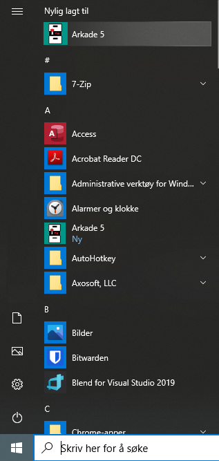

Installasjonsveiledning
=======================

Arkade 5
********

**Skrivebordsapplikasjon for Windows**

Installer .NET
~~~~~~~~~~~~~~

For å kjøre Arkade 5 må .NET 5 Desktop Runtime være installert:

   * Last ned |dotnet_desktop_x64_download_link| eller |dotnet_desktop_x86_download_link|

.. |dotnet_desktop_x64_download_link| raw:: html

   <a href="https://dotnet.microsoft.com/download/dotnet/thank-you/runtime-desktop-5.0.0-windows-x64-installer" target="_blank">.NET 5 Desktop Runtime  <b>x64</b></a>

.. |dotnet_desktop_x86_download_link| raw:: html

   <a href="https://dotnet.microsoft.com/download/dotnet/thank-you/runtime-desktop-5.0.0-windows-x86-installer" target="_blank">.NET 5 Desktop Runtime <b>x86</b></a>

Installer Arkade 5 
~~~~~~~~~~~~~~~~~~

Last ned siste versjon av Arkade 5 fra `<https://arkade.arkivverket.no/>`_

Start installasjonen ved å dobbeltklikke den nedlastede msi-filen.

**Merk: Windows Smart Screen advarsel**
Den følgende advarselen vil vises om Windows-maskinen har "Windows Smart Screen" satt på (Windows 10).

* Klikk på "Mer info"
* Klikk "Kjør likevel"

**Følg installasjonsveiviseren og aksepter alle de foreslåtte installasjonsvalgene.**

Kjør programmet
~~~~~~~~~~~~~~~

* Start -> Alle apper
* Finn "Arkade 5" i applikasjons-listen
* Klikk på "Arkade 5" for å kjøre programmet

Avinstallasjon av programmet (Windows 10)
~~~~~~~~~~~~~~~~~~~~~~~~~~~~~~~~~~~~~~~~~

* Klikk Start -> Instillinger -> System -> Apper og funksjoner
* Velg "Sorter etter installasjonsdato"
* Velg "Arkade" i listen over installerte programmer
* Klikk "Avinstaller"
* Klikk "Avinstaller" igjen i nytt vindu
* Klikk "Ja" på Brukerkontokontroll-advarselen fra Windows

__________________________________________________________________________

Arkade 5 CLI 
************

**Frittstående kommandolinjegrensesnitt for Linux, macOS og Windows**

Installer .NET
~~~~~~~~~~~~~~

For å kjøre Arkade 5 CLI må .NET 5 Runtime være installert.

Med Ubuntu/Debian kan .NET 5 Runtime installeres med følgende kommando:
    
.. code-block:: bash

	sudo apt-get install -y dotnet-runtime-5.0

* **Linux:** Se |dotnet_linux_instructions_link| for din Linux-distribusjon
* **macOS:** Last ned |dotnet_macos_x64_download_link|
* **Windows:** Last ned |dotnet_windows_x64_download_link| eller |dotnet_windows_x86_download_link|

.NET 5 Runtime er inkludert i, og ikke nødvendig å installere i tillegg til, .NET 5 **Desktop** Runtime (som er krevet av Arkade 5 skrivebordsapplikasjon).

.. |dotnet_linux_instructions_link| raw:: html

   <a href="https://docs.microsoft.com/dotnet/core/install/linux-package-managers" target="_blank">installasjonsinstruksjoner</a>

.. |dotnet_macos_x64_download_link| raw:: html

   <a href="https://dotnet.microsoft.com/download/dotnet/thank-you/runtime-5.0.0-macos-x64-installer" target="_blank">.NET 5 Runtime <b>x64</b></a>

.. |dotnet_windows_x64_download_link| raw:: html

   <a href="https://dotnet.microsoft.com/download/dotnet/thank-you/runtime-5.0.0-windows-x64-installer" target="_blank">.NET 5 Runtime <b>x64</b></a>

.. |dotnet_windows_x86_download_link| raw:: html

   <a href="https://dotnet.microsoft.com/download/dotnet/thank-you/runtime-5.0.0-windows-x86-installer" target="_blank">.NET 5 Runtime <b>x86</b></a>

Installer Arkade 5 CLI
~~~~~~~~~~~~~~~~~~~~~~

Last ned siste versjon av Arkade 5 CLI fra `<https://arkade.arkivverket.no/>`_

Linux/Mac
---------

Pakk ut den nedlastede zip-filen til ønsket plassering. Eksemplet bruker :file:`/opt/Arkade5CLI-{2.x.x}/`, der "*2.x.x*" viser til aktuell versjon.

Gjør deretter :file:`arkade.sh` kjørbar med følgende kommando:

.. code-block:: bash

	chmod +x /opt/Arkade5CLI-2.x.x/arkade.sh

Gjør `Siegfried <https://www.itforarchivists.com/siegfried/>`_ (bundlet programvare for PRONOM formatsjekking) kjørbar:

.. code-block:: bash

	chmod +x /opt/Arkade5CLI-2.x.x/Bundled/Siegfried/siegfried*

**Merk: macOS brukere må i tillegg sikkerhetsklarere** :file:`siegfried_mac` **med følgende kommando\*:**

.. code-block:: bash

	sudo xattr -rd com.apple.quarantine /opt/Arkade5CLI-2.x.x/Bundled/Siegfried/siegfried_mac

Informasjon om hva som skjer i kulissene kan blant annet leses `her <https://support.apple.com/en-us/HT202491>`_.

*\*Det er ikke anbefalt å sikkerhetsklarere en hvilken som helst applikasjon. Bare dersom du er helt sikker på at applikasjonen er trygg bør den sikkerhetsklareres.*

Tilgjengeliggjør :code:`arkade` fra hvor som helst i filsystemet
........................................................

Kjør følgende kommandoer:

.. code-block:: bash

	sudo ln -s -f /opt/Arkade5CLI-2.x.x/arkade.sh /usr/local/bin/arkade
	
	sudo chmod +x /usr/local/bin/arkade

Windows
-------

Pakk ut den nedlastede zip-filen til ønsket plassering. Eksemplet bruker :file:`C:\\Programfiler\\Arkade5CLI-{2.x.x}\\`, der "*2.x.x*" viser til aktuell versjon.

Tilgjengeliggjør :code:`arkade` fra hvor som helst i filsystemet
........................................................

* Åpne Ledetekst (cmd) som administrator

.. image:: img/OpenCmdAsAdmin.png

* Kjør følgende kommando

.. code-block:: batch

	echo "C:\Programfiler\Arkade5CLI-2.x.x\arkade.bat" > C:\Windows\arkade.bat

Kjør Arkade 5 CLI
~~~~~~~~~~~~~~~~~

*Det spiller ingen rolle hvor i filsystemet Arkade 5 CLI kjøres fra; plassering for alle inn- og ut-data velges som parametre ved kjøring.*

`Se brukerveiledning for Arkade 5 CLI <Brukerveiledning.html#arkade-5-cli>`_

Avinstaller Arkade 5 CLI
~~~~~~~~~~~~~~~~~~~~~~~~

* Slett katalogen Arkade5CLI-<versjon>
* Slett eventuelle gjenværende systemlogger
* **Linux/Mac:** kjør :code:`sudo rm /usr/local/bin/arkade`
* **Windows:** Åpne ledetekst som administrator og kjør :code:`del C:\Windows\arkade.bat`

*Mindre enn 1 uke gamle system- og feillogger slettes ikke automatisk etter kjøring.* `Les mer ... <Brukerveiledning.html#prosesseringsomrade-cli>`_
