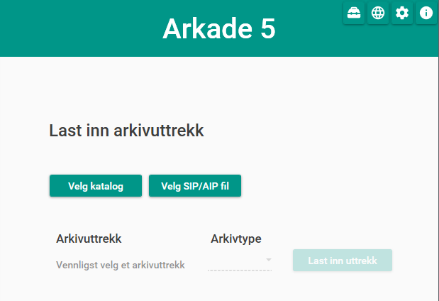

.. Arkade5 documentation master file, created by
   sphinx-quickstart on Thu Dec  1 09:48:38 2016.
   You can adapt this file completely to your liking, but it should at least
   contain the root `toctree` directive.

Arkade 5 - testverktøy for arkivuttrekk
=======================================

* |Installer Arkade 5|_

.. |Installer Arkade 5| replace:: **Installer Arkade 5**
.. _Installer Arkade 5: Installasjonsveiledning.html

4. september 2017 lanserte `Arkivverket <https://www.arkivverket.no>`_ versjon 1.0 av et nytt testverktøy - "Arkade 5".

Arkade vil etter hvert erstatte alle de testverktøy som Arkivverket har for å teste kvalitet av datasett generert fra arkivsystemer. Et viktig poeng er at Arkade kan teste så å si alle aktuelle varianter av arkivuttrekk. I dag støtter Arkade 5 følgende:

* Fagsystemer
* Noark-3
* Noark 5 versjon 3.1, 4.0 og 5.0

Arkade tester arkivuttrekk, produserer testrapporter og "pakker inn" data basert på gjeldende arkivstandarder for metadata. Testing av data baserer seg primært på Arkivverkets standard `ADDML <https://www.arkivverket.no/forvaltning-og-utvikling/regelverk-og-standarder/andre-arkivstandarder/addml-archival-data-description-markup-language>`_ for beskrivelse av datastrukturer. 

Arkade er en frittstående applikasjon som fritt kan lastes ned og enkelt installeres av alle. Programmet er svært enkelt i bruk. I prosjektfasen er det hentet innspill, kommentarer og idéer fra både kommunal og statlig sektor. Ved å senke terskelen for bruk av testverktøy håper vi å forenkle prosessene både hos arkivskapere og arkivinstitusjoner. Blant annet vil feil og avvik kunne oppdages mye tidligere, noe som sparer både tid og kostnader for alle involverte.
All kildekode og funksjonalitet i Arkade er lagt ut som åpen kildekode, så det vil også være mulig for eksterne å lage spesialtilpasninger.

Innhold
~~~~~~~

.. toctree::
   :maxdepth: 2

   Installasjonsveiledning
   Brukerveiledning
   Systemdokumentasjon
   Versjonshistorikk
